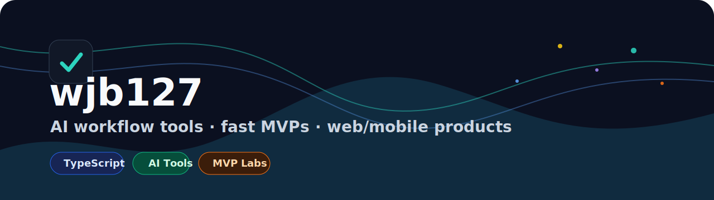

  

  <strong>Building AI workflow tools, fast MVPs, and launch-ready web/mobile products.</strong>

  <a href="https://github.com/wjb127?tab=repositories&q=&type=&language=typescript&sort=stargazers">TypeScript</a>
  ·
  <a href="https://github.com/wjb127?tab=repositories&q=ai&type=&language=&sort=stargazers">AI Products</a>
  ·
  <a href="https://github.com/wjb127?tab=repositories&q=landing&type=&language=&sort=updated">Landing Pages</a>
  ·
  <a href="https://github.com/wjb127?tab=repositories&q=claude&type=&language=&sort=updated">Claude Code Tools</a>

## Highlights

<!-- HIGHLIGHTS:START -->
### [codex-image](https://github.com/wjb127/codex-image) ⭐ 29
Claude Code skill for AI image generation via Codex CLI OAuth. No API key needed.

### [claude-smart-clear](https://github.com/wjb127/claude-smart-clear) ⭐ 0
Save recent Claude Code context, run `/clear`, and restore the session without losing the thread.

### [local-gemma-agent](https://github.com/wjb127/local-gemma-agent) ⭐ 0
Local AI agent example powered by Ollama and Gemma, designed to run without external API keys.

### [one-min-startup-kit](https://github.com/wjb127/one-min-startup-kit) ⭐ 0
AI-assisted MVP testing kit with landing page generation, fake checkout, lead capture, and analytics.

### [nextjs-weight-calendar](https://github.com/wjb127/nextjs-weight-calendar) ⭐ 0
Mobile-first weight tracking app built with Next.js, Supabase, charts, and calendar UX.

### [sysmon-gui](https://github.com/wjb127/sysmon-gui) ⭐ 0
macOS system monitor desktop app built with Tauri, React, and TypeScript.

⭐ Star counts update daily via GitHub Actions · last sync: `2026-05-02`
<!-- HIGHLIGHTS:END -->

## Build Stack

## Project Map

| Area | Repos |
| --- | --- |
| AI workflow tools | [`codex-image`](https://github.com/wjb127/codex-image), [`claude-smart-clear`](https://github.com/wjb127/claude-smart-clear), [`local-gemma-agent`](https://github.com/wjb127/local-gemma-agent) |
| MVP experiments | [`one-min-startup-kit`](https://github.com/wjb127/one-min-startup-kit), [`landing-template-kr`](https://github.com/wjb127/landing-template-kr), [`webapp-landing-maker`](https://github.com/wjb127/webapp-landing-maker) |
| Web/mobile apps | [`nextjs-weight-calendar`](https://github.com/wjb127/nextjs-weight-calendar), [`worktimer-expo`](https://github.com/wjb127/worktimer-expo), [`ss-011-text-memory-quiz`](https://github.com/wjb127/ss-011-text-memory-quiz) |
| Design practice | [`refactoring-ui-practice`](https://github.com/wjb127/refactoring-ui-practice), [`nexora-ai-landing`](https://github.com/wjb127/nexora-ai-landing), [`km-59-law-landing-homepage-renewal`](https://github.com/wjb127/km-59-law-landing-homepage-renewal) |

## GitHub Stats

  
  

  

