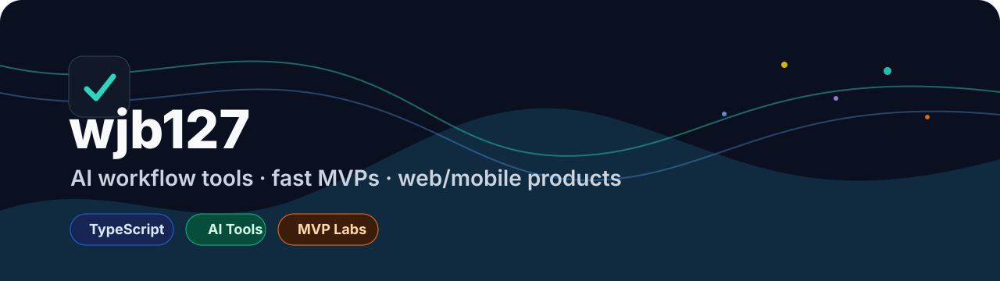

  

  <strong>Building AI workflow tools, fast MVPs, and launch-ready web/mobile products.</strong>

  <a href="https://github.com/wjb127?tab=repositories&q=&type=&language=typescript&sort=stargazers">TypeScript</a>
  ·
  <a href="https://github.com/wjb127?tab=repositories&q=ai&type=&language=&sort=stargazers">AI Products</a>
  ·
  <a href="https://github.com/wjb127?tab=repositories&q=landing&type=&language=&sort=updated">Landing Pages</a>
  ·
  <a href="https://github.com/wjb127?tab=repositories&q=claude&type=&language=&sort=updated">Claude Code Tools</a>

## Highlights

<!-- HIGHLIGHTS:START -->
### [codex-image](https://github.com/wjb127/codex-image) ⭐ 54
Claude Code skill for AI image generation via Codex CLI OAuth. No API key needed.

<b>More projects</b> (7)

- **[claude-mem](https://github.com/wjb127/claude-mem)** ⭐ 4 — Per-project external memory for Claude Code. 8KB markdown chapters, recall by keyword to save context window.
- **[agy-image](https://github.com/wjb127/agy-image)** ⭐ 1 — Claude Code skill for AI image generation via Antigravity CLI (Gemini). Google OAuth, no API key.
- **[claude-smart-clear](https://github.com/wjb127/claude-smart-clear)** — Save recent Claude Code context, run `/clear`, and restore the session without losing the thread.
- **[local-gemma-agent](https://github.com/wjb127/local-gemma-agent)** — Local AI agent example powered by Ollama and Gemma, designed to run without external API keys.
- **[one-min-startup-kit](https://github.com/wjb127/one-min-startup-kit)** — AI-assisted MVP testing kit with landing page generation, fake checkout, lead capture, and analytics.
- **[nextjs-weight-calendar](https://github.com/wjb127/nextjs-weight-calendar)** — Mobile-first weight tracking app built with Next.js, Supabase, charts, and calendar UX.
- **[sysmon-gui](https://github.com/wjb127/sysmon-gui)** — macOS system monitor desktop app built with Tauri, React, and TypeScript.

⭐ Star counts update daily via GitHub Actions · last sync: `2026-08-29`
<!-- HIGHLIGHTS:END -->

## Build Stack

## Project Map

| Area | Repos |
| --- | --- |
| Claude Code skills | [`codex-image`](https://github.com/wjb127/codex-image), [`claude-mem`](https://github.com/wjb127/claude-mem), [`agy-image`](https://github.com/wjb127/agy-image), [`agy-review`](https://github.com/wjb127/agy-review), [`consulting-report`](https://github.com/wjb127/consulting-report) |
| Testing &amp; QA skills | [`claude-skill-web-testing`](https://github.com/wjb127/claude-skill-web-testing), [`claude-skill-pixel-verification`](https://github.com/wjb127/claude-skill-pixel-verification), [`claude-smart-clear`](https://github.com/wjb127/claude-smart-clear) |
| Infrastructure labs | [`ss-044-live-stream-platform-lab`](https://github.com/wjb127/ss-044-live-stream-platform-lab), [`ss-038-edge-cms-lab`](https://github.com/wjb127/ss-038-edge-cms-lab), [`ss-035-cms-perf-lab`](https://github.com/wjb127/ss-035-cms-perf-lab) |
| Products | [`worktimer-expo`](https://github.com/wjb127/worktimer-expo), [`sysmon-gui`](https://github.com/wjb127/sysmon-gui), [`nextjs-weight-calendar`](https://github.com/wjb127/nextjs-weight-calendar) |
